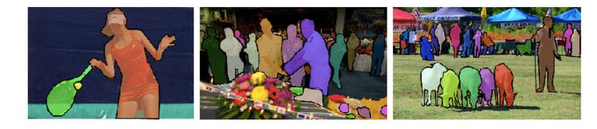

# COCO single

English · [한국어](../../docs/ko/datasets/coco_single/README.md)



A 10-class classification subset of [COCO 2017](https://cocodataset.org/). Each selected image has exactly one annotated object instance from one of the ten classes.

## Protocol

- **Classes:** `giraffe`, `airplane`, `clock`, `zebra`, `train`, `bird`, `elephant`, `toilet`, `stop sign`, `bear` (in this order).
- **Train / validation:** Balanced across classes using `train2017`. The verified split has 321 train and 53 validation images per class.
- **Probe:** 20 validation images per class. **Test:** 297 eligible images from `val2017`. **Split seed:** `20260922`.
- Exclude images with zero or multiple annotated objects, crowd annotations, non-positive-area annotations, or missing segmentation. Remove duplicates with identical decoded RGB hashes or a 64-bit dHash distance of at most 4.
- Use the object's segmentation as the foreground mask. Resize images to 224×224; apply horizontal flips only during training. A 16×16 patch size gives 196 spatial tokens.

## Files

```text
coco_single/
  manifest.json
  images/{train2017,val2017}/*.jpg
  masks/{train2017,val2017}/*.png
```

The manifest records the single-instance selection rule, class order, and each image's `id`, `label`, `split`, `probe` flag, image/mask paths, and SHA-256 hashes. Downloaded data is written to the Git-ignored `data/coco_single/` directory.

## Preparation

From the repository root:

```bash
bash datasets/coco_single/setup.sh
```

This installs the data-preparation dependencies in `.venv-data/`, downloads the COCO 2017 annotations and eligible source images, builds foreground masks, removes duplicates, creates the documented train/validation/test split, and validates the result. It uses CPU only. Rerun the command to reuse a completed dataset or resume cached downloads. If `data/coco_single/` contains an older dataset, move that directory aside before running setup. Models and results from the previous class set are not directly comparable. The pipeline is adapted from [aim-lab-test-2](https://github.com/jeehoo0507/aim-lab-test-2) (commit `0ee46e4`); the class and one-instance rules are defined here.

## Validation

```bash
python3 scripts/check_assets.py coco data/coco_single
python3 scripts/check_assets.py coco data/coco_single --full
```

The first command checks the manifest and file presence; `--full` also checks file hashes.
