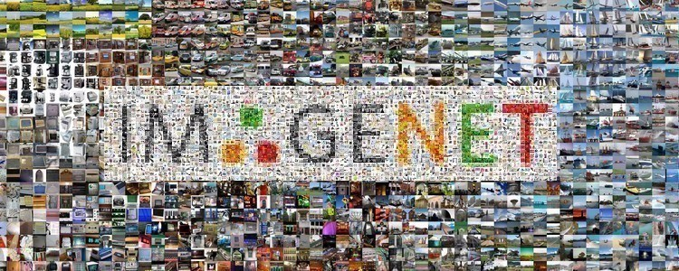

# ImageNet-1K (ILSVRC2012)

<p align="center">
  
</p>

The labeled **train** and **validation** splits are prepared for future from-scratch training and evaluation of ImageNet-pretrained models. This setup does not download or prepare the unlabeled official test split.

## Preparation

Sign in at the [official ImageNet download page](https://image-net.org/challenges/LSVRC/2012/2012-downloads.php) and place these three archives in the Git-ignored `data/imagenet/archives/` directory:

```bash
mkdir -p data/imagenet/archives
```

```text
data/imagenet/archives/
  ILSVRC2012_img_train.tar
  ILSVRC2012_img_val.tar
  ILSVRC2012_devkit_t12.tar.gz
```

From the repository root, run:

```bash
bash datasets/imagenet/setup.sh
```

The command verifies the official archive MD5 values, extracts the images into the Git-ignored `data/imagenet/` directory, assigns validation labels from the devkit, and checks the result. It does not download the source archives. Training extraction requires substantial free disk space. To keep both archives and prepared images on another drive, run `bash datasets/imagenet/setup.sh /mnt/archives /mnt/data/imagenet`. Completed training classes are reused after an interruption.

```text
data/imagenet/
  manifest.json
  train/<wnid>/*.JPEG   # 1,281,167 labeled images
  val/<wnid>/*.JPEG     # 50,000 labeled images; 50 per class
```

`manifest.json` records the 1,000 WordNet IDs in sorted order, split counts, and SHA-256 hashes of the source archives. It has no test labels or test images. Use the validation split for local top-1/top-5 evaluation; report it as **ImageNet-1K validation**, not official test accuracy. The official test split requires [submission to ImageNet's evaluation server](https://www.image-net.org/challenges/LSVRC/) for scoring.

## Validation

```bash
python3 scripts/check_assets.py imagenet data/imagenet
sha256sum data/imagenet/manifest.json
```

The first command checks class directories, filenames, and split counts. Keep the manifest hash with any reported result. The [TorchVision ImageNet implementation](https://github.com/pytorch/vision/blob/main/torchvision/datasets/imagenet.py) is a reference for the official archive names and validation-label mapping.
