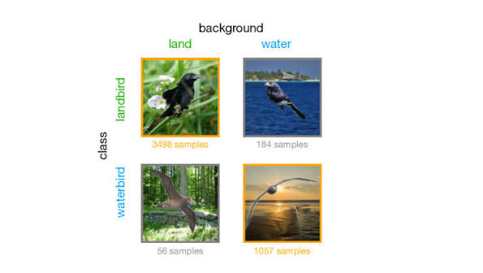

# Waterbirds

[English](../../../../datasets/waterbirds/README.md) · 한국어

<p align="center">
  
</p>

[Waterbirds](https://github.com/kohpangwei/group_DRO#waterbirds)는 CUB 새 이미지를 Places 배경에 합성한 데이터셋입니다. 새 종류 `y`(landbird/waterbird)와 배경 `place`(land/water)로 네 그룹을 나눕니다. 그림은 그룹 구성을 보여주는 예시이며, 실제 샘플 수는 `metadata.csv`에서 확인하세요.

## 구성 기준

- 원본 `metadata.csv`의 split을 유지합니다: `0` train, `1` validation, `2` test.
- 전체 정확도, 그룹별 정확도, 최악 그룹 정확도를 보고합니다. 학습 데이터에서는 라벨과 배경의 상관관계가 강합니다.
- 분류에는 합성 이미지와 metadata가 필요합니다. 전경/배경 패치 분석에는 원본 CUB segmentation 마스크도 필요합니다.
- 이전 토큰 예산 실험에서는 학습 이미지와 마스크에 같은 random resized crop(224×224)과 가로 뒤집기를 적용했습니다. 평가는 256으로 resize한 뒤 중앙에서 224를 crop했습니다. 전처리를 바꾸면 기록하세요.

## 파일 구조

```text
waterbird_complete95_forest2water2/
  metadata.csv
  <metadata.csv에 나열된 이미지>
CUB_200_2011/segmentations/
  <전경/배경 분석에 사용하는 PNG 마스크>
```

## 다운로드

저장소 루트에서 실행하세요.

```bash
bash datasets/waterbirds/setup.sh
```

이 명령은 [원본 group_DRO Waterbirds 데이터](https://github.com/kohpangwei/group_DRO#waterbirds)를 Git에서 제외된 `data/waterbird_complete95_forest2water2/`에 다운로드하고 이미지와 metadata를 검증합니다. 공개된 train/validation/test split을 그대로 유지합니다. CUB segmentation 마스크는 별도 파일이므로 이 다운로드에 포함되지 않습니다.

기준 실험에서 전경 패치 포함률을 계산하려면 [공식 CUB segmentation](https://data.caltech.edu/records/w9d68-gec53)을 다운로드하세요.

```bash
python3 datasets/waterbirds/download_masks.py
```

마스크가 없으면 기준 실험 실행기가 이 명령을 자동으로 수행합니다. 아카이브 체크섬을 확인하고 Waterbirds 이미지마다 대응하는 CUB 마스크를 연결합니다.

## 검증

```bash
python3 scripts/check_assets.py waterbirds data/waterbird_complete95_forest2water2
python3 scripts/check_assets.py waterbirds data/waterbird_complete95_forest2water2 --seg-root /path/to/CUB_200_2011/segmentations
```
